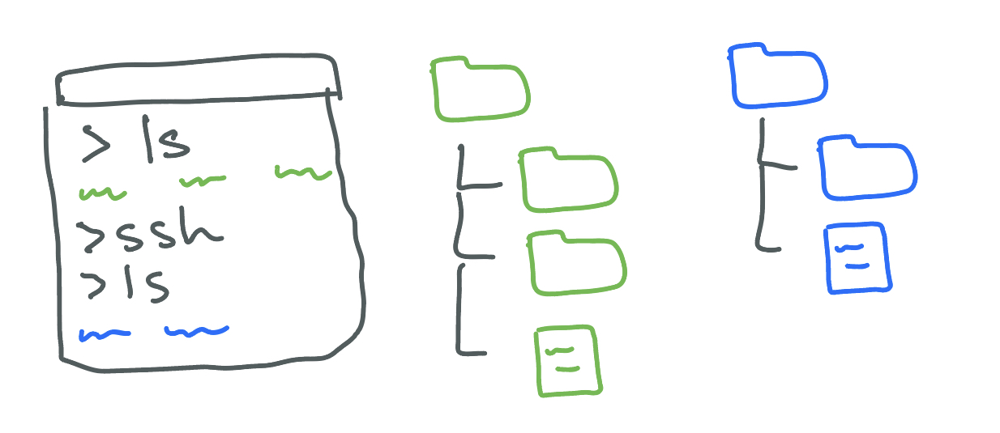

# UCSD CSE29 WI26 Syllabus and Logistics

[Joe Gibbs Politz](https://jpolitz.github.io) (Instructor)

CSE 29 introduces you to the broad field of systems programming, including 1)
the basics of how programs execute on a computer, 2) programming in C with
direct access to memory and system calls, 3) software tools to manage and
interact with code and programs. All very cool stuff that makes every programmer
better!

#  Basics

- Lecture (attend the one you're enrolled in):
  - A section: Tue/Thu 11:00am, Center Hall 115
  - B section: Tue/Thu 12:30pm, Center Hall 113
- Discussions:
  - A section: Tue 5:00pm, Pepper Canyon Hall 109
  - B section: Thu 5:00pm, Center Hall 212
- Labs: Wednesdays (check your schedule!). Either B240 or B250 in the [CSE building](https://map.concept3d.com/?id=1005#!m/164780?share)
- Exams:
  - Weeks 4 and 8: [AP&M Testing Center](https://map.concept3d.com/?id=1005#!m/167186?share), flexible scheduling on [PrairieTest](https://us.prairietest.com/)
  - Week 10: During your regularly-scheduled lab time
  - Finals week: In CSE labs scheduling instructions coming soon!
- Final exam: [AP&M Testing Center](https://map.concept3d.com/?id=1005#!m/167186?share), flexible scheduling in final exam week on [PrairieTest](https://us.prairietest.com/)
- Professor office hours:
  - Tuesday 2:30-3:30pm, CSE 3206 (advising focused, open to all students)
  - Wednesday 1:30-2:30pm CSE B260 (CSE29 students only)
- Office Hours: Coming soon!
- Q&A forum: [Piazza](https://piazza.com/class/mjz0y0rvk9c2lw)
- PrairieLearn: [https://us.prairielearn.com](https://us.prairielearn.com)
- Textbook/readings: [Dive Into Systems](https://diveintosystems.org/book/), plus additional readings we will assign
  - Free: [MIT Missing Semester](https://missing.csail.mit.edu/)
  - Not free but pretty cheap: [Julia Evans Zines](https://wizardzines.com/), especially [The Pocket Guide to Debugging](https://wizardzines.com/zines/debugging-guide/)

# Office Hours Calendar

<iframe src="https://calendar.google.com/calendar/embed?src=c_ae9767c348e966bfab21111de9970ad83a36f155ee0583d85874fde005ad9232%40group.calendar.google.com&ctz=America%2FLos_Angeles" style="border:solid 1px #777" width="800" height="600" frameborder="0" scrolling="no"></iframe>

# Schedule

- **Week 1: Welcome, Strings and Bitwise Representations**
  - **Readings and Videos**
    - [The UNIX Command Line](https://diveintosystems.org/book/Appendix2/cmdln_basics.html)
    - [Arrays and Strings (In C)](https://diveintosystems.org/book/C1-C_intro/arrays_strings.html)
    - [Brief Bitwise Operators Intro](https://www.youtube.com/watch?v=iU-0YhRFf7Y)
    - [Counting 0 bits](https://www.youtube.com/watch?v=M5mVVJHpNQ8)
  - **Lecture Materials**
    - Tuesday
      - Annotated Handout: [11am](lec/01-06-welcome/lecture_notes_jan6_11am.pdf) [12:30pm](lec/01-06-welcome/ScanJan06,2026Joe'sNotes.pdf)
      - [Lecture Summary](lec/01-06-welcome/summary.pdf)
    - Thursday
      - [Handout](lec/01-08-cstring/lecture.pdf)
      - Annotated Handout: [11am](lec/01-08-cstring/lecture_notes_jan8_11am.pdf) [12:30pm](lec/01-08-cstring/lecture_notes_jan8_1230pm.pdf)
      - [Lecture Summary Slides](lec/01-08-cstring/summary.pdf)
      - [Lecture Summary with Speaker Notes](lec/01-08-cstring/summary-speaker.pdf)
# Course Components

There are three main parts of the course: **Assignments**, **Exams**, and
**Social Learning**.

## Assignments

The course has 5 **assignments** that involve programming and writing. For each
there will be:

- A **problem set** that has practice problems related to the assignment
- A **programming project** where you create a program that does something
  interesting and that we automatically test
- **Design questions** about the programming project

**Grading**: There are 6 points available for each assignment.

- **2** points for the corresponding problem set (2 points for fully correct and
  complete by the deadline, 1 point for incomplete at the deadline).
- **2** points for program correctness (2 points for perfect or nearly-perfect, 1 point
  for significant errors)
- **2** points for design questions (2 points for perfect or nearly-perfect, 1
  point for significant errors)

After each assignment is graded, you'll have a chance to _resubmit_ all
components based on the feedback you received, which will detail what you need
to do to increase your score. You can increase your score by up to **1** point
in each component on a resubmit.

This is also the only late policy for assignments. Unsubmitted assignments are
initially given a **0**, and can get a maximum of **3** points on resubmission.

## Exams

There will be 3 exams during the quarter and make-up opportunities in finals
week.

Exams will use a mix of the testing facility in [AP&M
B349](https://map.concept3d.com/?id=1005#!m/167186?share) (weeks 4 and 8), and
our regularly-scheduled lab times (week 10). You will schedule your week 4/8
exam on [PrairieTest](https://us.prairietest.com/) by logging in with your
@ucsd.edu account. You can schedule the exam at a time that's convenient for
you in the given exam week, and you will go to that lab and check in for your
exam at the time you picked. The exam will be proctored by staff from the
[Triton Testing Center](https://tritontesting.ucsd.edu/) (not by the course
staff from this course). No study aids or devices are allowed to be used in the
testing center. You will need only a photo ID and something to write with
(scratch paper is available on request). The Triton Testing Center has shared
a [document of rules and tips](./images/Helpful_Tips_CBTF.pdf) for using the
testing center.

The exams will be administered through
[PrairieLearn](https://www.prairielearn.com/about) and
[PrairieTest](https://us.prairietest.com). The exams will have a mix of
questions; they will typically include some that involve programming and
interacting with a terminal.

We'll know the precise scheduling by the end of week 1 for both the exams during
the quarter and the final exam.

## Social Learning

Learning (in college) is in part, a social process. Your engagement with it
forms part of your grade for the class.

### Lecture (Social Learning)

Lectures are designed to introduce you to concepts, show how I (Joe) approach
problems, give you a chance to ask questions about content, connect course
content to the world outside the classroom, talk to your classmates and the
staff, and provide an overarching story for the material.

Most lectures will come with two on-paper activities that are handed in for
credit:

- A _review check_, near the beginning of class. These serve mainly as a way to
  check in on content from previous lectures before starting the content for
  the day, and for us to get some information about how everyone is following
  along with lecture content. Don't think of them as quizzes, rather as an
  engagement check. You can discuss these with your classmates, and they are
  graded on completeness rather than correctness.
- An _exit slip_ at the end of class (last 5 minutes). These serve as a way to
  get feedback from you on the lecture; they will often you to restate or
  summarize a learning outcome, or say what the “fuzziest” concept from
  lecture was for you.

We say these will happen in “most” lectures because sometimes we may skip
one or both for various timing or logistics reasons.

**Grading**: Each lecture has 3 social learning points available:

- **2** for the review check (only 1 point if handed in but incomplete)
- **1** for the exit slip

If you miss either or both during class, you can submit the makeup assignment
later for **1 point total**. This is the only way to make up credit for missing a lecture.

The makeup assignment requires both the review check and exit slip,
regardless of whether you turned one in during class. So:

- If you only hand in one during class, you can submit the full makeup assignment to earn 2/3 points for that day.
- If you miss lecture entirely, you can submit the full makeup assignment to earn 1 point.

All resubmissions must be before the next lecture to count, with no exceptions.

### Labs (Social Learning)

The course's lab component meets for 2 hours. In each lab you'll switch between
working on your own, working in pairs, and participating in group discussions
about your approach, lessons learned, programming problems, and so on.

The lab sessions and groups will be led by TAs and tutors, who will note your
participation in these discussions for credit. Note that you must
**participate**, not merely **attend**, for credit.

**Grading**: For each lab there are 4 possible points to earn:

- **1** for being present
- **2** for being an active, professional, productive participant while present
- **1** for submitting and/or getting work checked off that was done in lab

If you miss lab, you can earn the submission/check-off point by submitting the
check off work **before the next Tuesday at 11am**, but cannot earn the 3
points related to participation. There is no way to make up a lab beyond this
1 point, even for illness, travel, or emergencies. Our preference would be to
require all 10 labs for an A, and have some kind of excused absences. However,
tracking excused absences doesn't really scale, so this policy is how we handle
it.

### Discussions (Social Learning)

There are discussions on Tuesdays and Thursdays, led by the course staff, for
going over problem set problems and the programming assignments.

**Grading**: Attendance is taken, and attending discussion gives 1 social
learning point.

## Grading

Each component of the course has a minimum achievement level to get an A, B, or
C in the course. You must reach that achievement level in _all_ of the
categories to get an A, B, or C.

- **A** achievement:
  - ≥85 social learning points (may adjust depending on the total number of
    available lecture points)
  - ≥27/30 assignment points
  - ≥10/12 exam points
- **B** achievement:
  - 70-84 social learning points
  - 23-26 assignment points
  - 8-9 exam points
- **C** achievement:
  - 55-69 social learning points
  - 20-23 assignment points
  - 6-7 exam points

Below C achievement (in any category) is an F/No Pass.

Pluses and minuses will be given based on performance on social learning and
assignments (exam grades will **not** be used to determine plus and minus
grades; this is to avoid extra load on retake testing). We don't publish the
exact cutoffs in advance.

Requests to change this grading policy (for a specific student or class-wide)
will be denied with a link to this syllabus section. Consider this: we may, as
instructors, decide for academic reasons that the most accurate way of
assigning letter grades in the class needs to change (and we tend to only make
changes that improve letter grades relative to this starting policy). However,
it would be inappropriate for us to do so in response to student requests: that
could create an appearance that we give students the grades they ask for rather
than the grades they earned.

# Policies and Perspective

## CSE29, Large Language Models, and You

Evidence suggests that experts can generate (some kinds of) programs more
quickly with the assistance of large language models. But, they did not
_become_ experts by using them.

We offer the following metaphor as guidance:

Consider physical conditioning, let's take running for fitness in particular.
There are many machines in the world that are remarkably effective at moving
people around: electric scooters for example. Taking a scooter for a few miles
gets you to your destination more quickly and less sweatily than running, but
completely misses the point of the run. The goal of running for fitness has
little to do with getting to a destination and everything to do with the
changes that happen _inside your body_. Many people can run the same miles on
the same road and get the benefits from it, despite them all doing the same
work that a machine (the scooter) could have done.

Fitness is just one example like this. Similar comparisons make sense for
learning to play an instrument, perform onstage, or upskill at games like
billiards, darts, or Fortnite.

The programming in this class is like running for fitness (doing the typing and
thinking on your own), not about getting to a destination quickly (handing in a
completed program). The answers to many programming problems are known, or
close-to-known, and many tools exist that can generate part or all of them, and
there are many people who can write them faster than you. We assign the work
not because knowing a solution is particularly important, but because _the act
of creating the solution changes you_.

So, you _should not_ use AI to generate code or prose for work in this class.

That said, it's relatively difficult for us to _detect_ AI usage on take-home
work. It's also useful to know what AI and code generation can do. So feel free
to experiment, and do not read this policy as _prohibiting_, or assigning
_formal consequences_ to LLM use. A good way to go about learning in this
course is to _do the work yourself first_, then go back and see how the LLM
would have done it. Then you may be able to notice things, like the LLM
generating extra unnecessary code, or doing something in a more or less complex
way than you did it, or maybe doing exactly what you did! The key thing is that
you developed a sense of what a solution was supposed to look like, rather than
trusting the version from the machine.

(Also, the exams require that you program on your own, without the aid of any AI
assistants.)

## Device Policy

To a large degree, you are responsible for managing your time, attention, and
learning in lecture, and I hesitate to make policies that attempt to govern or
restrict your choices with respect to note taking or device use. However,
lecture is a communal space, and your actions can affect others' learning. In
particular, what you have on your screen _may be unavoidably in the field of
view of other students_. Because of this, you are responsible for a fragment of
the attention of everyone in a cone of space behind you. With this in mind,
the policy for lecture is that _if you use a device, you must have
lecture-related content onscreen_. There is even [research that
shows](https://www.sciencedirect.com/science/article/pii/S0360131520301007)
that the content of screens in the classroom, even quite far away, can have a
detrimental affect on learning. If you cannot resist checking social media,
playing a game, or doing other off-topic tasks during lecture, sit in the back
2 rows so that you are only having an affect on your own attention, or the
attention of others with a similar mindset.

## Assignments and Academic Integrity

You can use code that we provide or that your group develops in lab as part of
your assignment. If you use code that you developed with other students (whether
in lab or outside it), got from Piazza, or got from the internet, say which
students you worked with and a sentence or two about what you did together in
`CREDITS.txt`. All of the _writing_ in assignments (e.g. in open-ended written
questions) must be your own.

You **can** use an AI assistant like ChatGPT or Copilot to help you author
assignments in this class. If you do, you are **required** to include in
`CREDITS.txt`:

- The prompts you gave to the AI chat, or the context in which you used Copilot
  autocomplete
- What its output was and how you changed the output after it was produced (if
  at all)

This helps us _all_ learn how these new, powerful, and little-understood tools
work (and don't).

If you don't include a `CREDITS.txt` and it's clear you included code from
others or from an AI tool, you may lose credit or get a 0 on the assignment, and
repeated or severe violations can be escalated to reports of academic integrity
violations.

## Exams and Academic Integrity

It is a violation of academic integrity to share details of _your_ exam with
others until after you receive your grade for it. Keep in mind that the exams
are randomized to discourage casual cheating, so your exam may not be the same
one that others see. It is a violation of academic integrity to communicate
with anyone other than the official proctors during the exam, or to use devices
other than the ones you are using to complete the exam.

## Lab and Professionalism

Lab work will be highly collaborative, and designed to encourage communication
between students. Some of the activities will have you talk to other students,
or exchange code, ideas, or commands with other students, and write down what
happened.

In all of this communication, remember to be polite, professional, and focus on
the work. A huge part of the job of a working software professional or
researcher is professional and clear communication.

Some tricks for this: avoid statements that reference the author of the code,
frame negative feedback as possible improvements or ways your expectations were
violated, and take responsibility for anything you don't understand.

Examples:

- Don't say “You made a mistake here: ...” Instead say “On line I expect the
  condition to be true but I think it will be false because XYZ ... we could
  demonstrate that by doing ABC.”
- Don't say “It seems like you don't know about...”, instead say “On line
  10-12, these 3 lines could be shortened into one line using `grep -r` instead
  of `find` followed by `grep`: ....” And use some judgment: it's likely that
  some of this advice is helpful and constructive, and some of it is just
  showing off.
- Don't say “This code is (going to be) slow...” Instead wait until you can run
  it and try an example that demonstrates it “This code took 10 seconds to run
  for input XYZ and that seems like a lot. When we were writing ... I think I
  noticed that we did X, if we did Y instead I think it will go faster
- Don't say “That conditional is ugly:...” Instead say “I find it easier to
  read these conditions when they are written as .... because ...” If you don't
  have a good explanation to put after the “because”, how do you know it's a
  good suggestion? Refer also to the advice about not showing off
- Don't say “You wrote lines 20-24 very confusingly.” Instead say “I'm having
  trouble understanding lines 20-24. It would help me to work through an
  example of how that part is supposed to work”

# FAQ/AFQ (Anticipated Frequent Questions)

**Q: I am waitlisted for one of the sections at position N. What should I do?**

Come to class and do all the work as usual (you will have Canvas access to get
all the needed links) so you can be up to speed if you do get a spot. This is
aligned with [official department
policy](https://cse.ucsd.edu/undergraduate/spring-2025-undergraduate-course-updates#LateAddPolicy).

We can't make accurate predictions about chances of getting into the course
from a specific waitlist position, or control that process as instructors.

**Can I attend a lab section other than the one I'm enrolled in?**

No, please do not try to do this. The lab sections have limited seating and are
full. We cannot accommodate switching.

**How can I switch sections?**

You have to drop and re-add (which may involve getting [back on] the waitlist). Sorry.

**Can I leave lab early if I'm done or have a conflict?**

The labs are designed to not be things you can “finish”. Labs have plenty of
extension and exploration activities at the end for you to try out, discuss,
and help one another with. Co-located time with other folks learning the same
things is precious and what courses are for. Also, if you need an extrinsic
motivation, you won't get credit for participation if you don't stay, and
participate, the whole time. We can often accommodate one-off exceptions – if
you have a particular day where you need to leave early, it's a good idea to be
extra-engaged in your participation so your lab leader can give you
participation credit before you leave.

**Do I have to come to lab?**

Yes, see grading above.

**I missed lab, what should I do?**

The lab page will have instructions on how to submit the make-up, which can get
you 1 (of 4 possible) points.

**I missed my exam time, what should I do?**

Stay tuned for announcements about scheduling make-ups in final exam week.

**Where is the financial aid survey?**

We do this for you; as long as you submit something in the first two weeks, we
will mark you as commencing academic activity.

**When are the midterms scheduled?**

The midterms will be flexibly scheduled during the quarter using a testing
center. More details will come; you will need to set aside some outside-of-class
time to do them, but there is not a specific class-wide time you have to put on
your calendar.

**I have a conflict with the final exam time, what can I do?**

The final exam will also be flexibly scheduled during final exam week using the
testing center.
