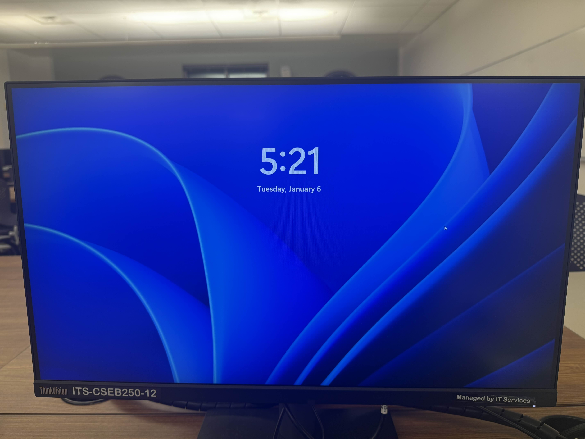
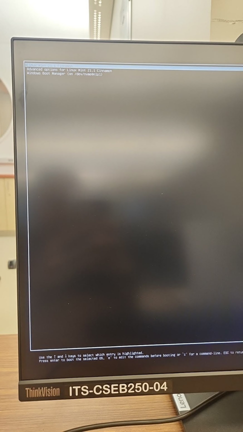
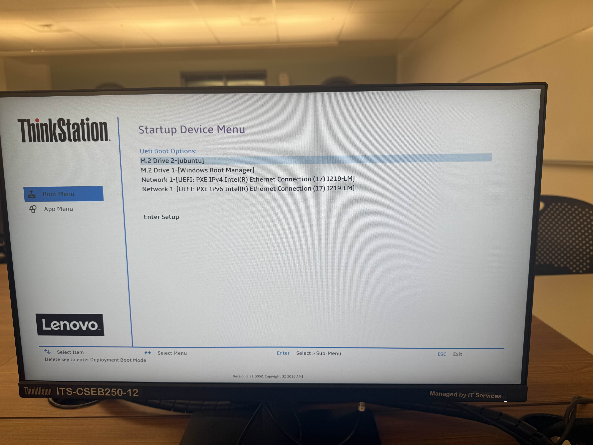
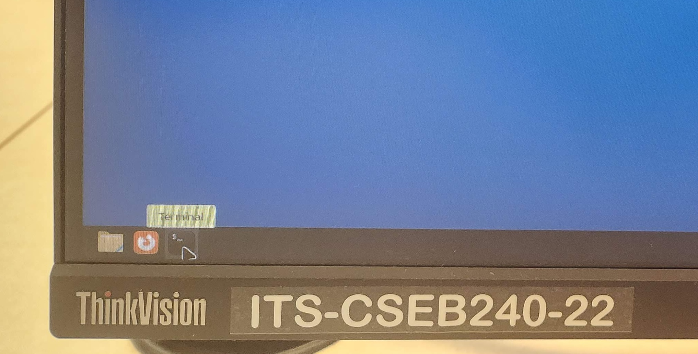
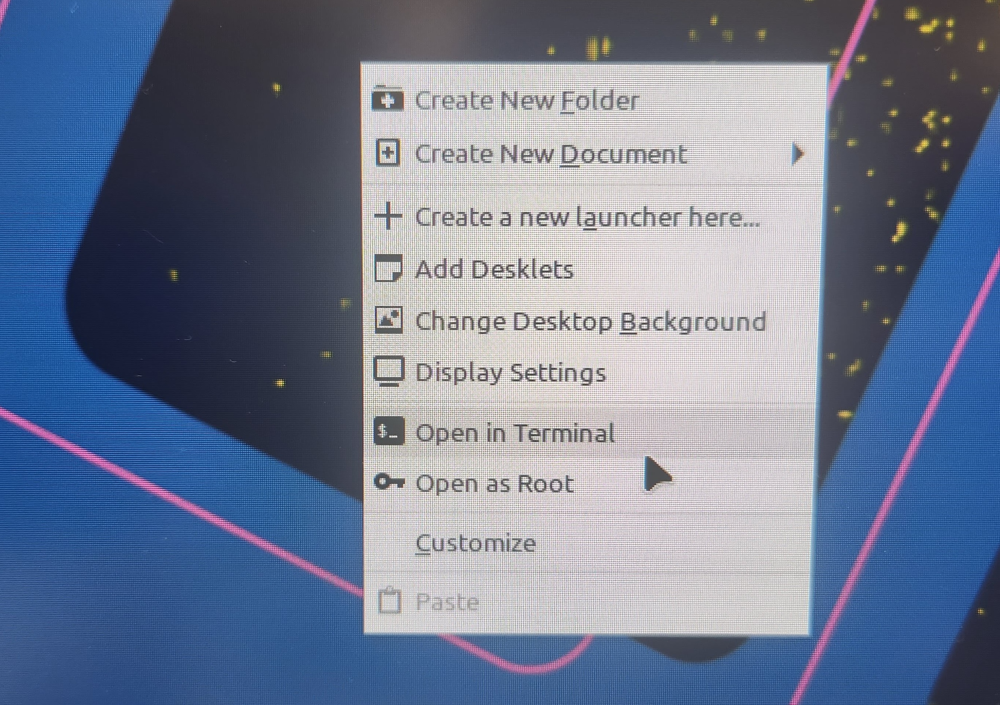

# Lab 1
January 7, 2026

## Welcome! Lab setup

### Fill out the [Lab 1 Form](https://forms.gle/viqCCYAUkF1y9bGU9)

### Boot to Linux and Login

If you computer is Windows and looks like this


Restart the computer and when shown the following menu


Select the top option: "Linux Mint 21.1 Cinnamon" by using the arrow keys and pressing enter.

If you were not presented with this menu, restart and hold f12 has it reboots.  
Then on this menu


Select the ubuntu option as shown using the arrow keys and press enter to reach the first black menu.

Then you can log into the computer you are sitting at (use your “Active Directory” username and password – the same one you use for Gmail/Canvas) 

## References


### Terminal

On the lab machines, you can open a terminal either one of two ways:
* On the toolbar at the bottom of the screen, there are a few icons on the far right. The last one (shaped like a black rectangle) will open a new terminal.

⠀
* Right-click on the desktop, and a menu of options will appear. Select the option to create a new terminal. 

⠀

The following are some commands you can run in your terminal. To run a command, type it in and press enter.

#### `pwd`
Prints the name of the **working directory**, which is the location in the file system that the terminal is currently in.
#### `whoami`
Prints the username of the account you are using on the computer.
#### `uname -a`
Prints information about the computer that the terminal is connected to.
#### `cd [directoryname]`
Changes to the directory named [directoryname]. The special directory `..` takes you up one level.
#### `ls`
Prints a list of all the files and directories that are in the working directory.
#### `mkdir [directoryname]`
Creates a new directory called [directoryname].
#### `touch [filename]`
Creates a new file called [filename].
#### `rm [filename]`
Removes the file called [filename].
#### `man [commandname]`
Displays a documentation page for the terminal command [commandname].

### Logging into ieng6
#### `ssh yourusername@ieng6.ucsd.edu`
Your account name is the same account name as the one that’s used for your school Google account, i.e. it is the string that precedes “@ucsd.edu” in your school email address. In case you need to check the status of your student account, refer to the [UCSD Student Account Lookup page](https://sal.ucsd.edu/).
* Your password is the same password that you use for your student account on other websites (i.e. Canvas). The terminal does not show the characters that you type when you enter your password.
* The first time you use this command, you will get a message like this:

```
⠀$ ssh yourusername@ieng6.ucsd.edu
The authenticity of host 'ieng6.ucsd.edu (128.54.70.227)' can't be established.
RSA key fingerprint is SHA256:ksruYwhnYH+sySHnHAtLUHngrPEyZTDl/1x99wUQcec.
Are you sure you want to continue connecting (yes/no/[fingerprint])?
```
Copy and paste the one of the corresponding listed public key fingerprints and press enter. [^1]
* If you see the phrase **ED25519 key fingerprint** answer with: SHA256:8vAtB6KpnYXm5dYczS0M9sotRVhvD55GYz8EjN1DYgs
* If you see the phrase **ECDSA key fingerprint** answer with: SHA256:/bQ70BSkHU8AEUqommBUhdAg0M4GaFIHLKq0YQyKvmw
* If you see the phrase **RSA key fingerprint** answer with: SHA256:npmS8Gk0l+zAXD0nNGUxr7hLeYPn7zzhYWVKxlfNaeQ

[^1]: Getting the fingerprint from a trusted source is the best thing to do here. You can also just type “yes”, as it's pretty unlikely anything nefarious is going on. If you get this message when you're connecting to a server you connect to often, it could mean someone is trying to listen in on or control the connection. This answer is a decent description of what's going on and how you might calibrate your own risk assessment: [Ben Voigt's answer](https://superuser.com/questions/421074/ssh-the-authenticity-of-host-host-cant-be-established/421084#421084)

### PrairieLearn
PrairieLearn URL: [us.prairielearn.com](http://us.prairielearn.com/)

Enroll in **CSE 29: Systems Programming and Software Tools, Fall 2025** at [https://us.prairielearn.com/pl/enroll](https://us.prairielearn.com/pl/enroll)

Complete parts 1 and 2 of the vimtutor demo. (Run “vimtutor” in the terminal)
