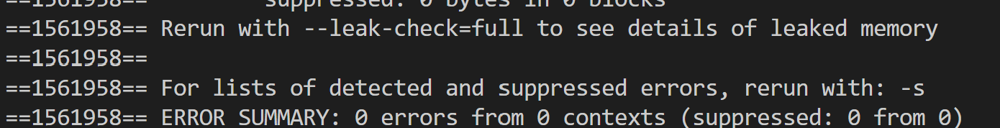

# Lab 8 Reference Document

##  [Starter Repository](https://classroom.github.com/a/FOspjmj8)

# Part 1: Valgrind
--------------------------------

to run valgrind on an executable file called `my_program`, run:   
`valgrind ./my_program`

the end out your output will read something like:


as it states, running `valgrind --leak-check=full ./my_program` will give more information.

> Note on the `-g`: This flag instructs GCC to add debugging symbols to the compiled executable. These symbols enable GDB to look up and show your source code during debugging. They also enable Valgrind to show you line numbers in its error backtraces.


# Part 2: Scripts in a nut*shell* and Pokemon Mailtime
--------------------------------

## Aside: The executable bit

The file permissions scheme used in Unix-style
systems is designed to protect files from unauthorized access and
unsafe execution. It prevents you from snooping into other users' files on `ieng6`.
It also prevents you from executing a file by accident. Under this scheme,
**three bits** describe the operations that can be performed on every file:
**Read** (`r`), **Write** (`w`), and **Execute** (`x`). To see the settings for
these bits for all the files in a directory, **run `ls -l` and focus on the
second, third, and fourth character in each row**, which
specify what the *owner* of the file is allowed to do. For example, in
`-rwxr-x---`, `rwx` means the owner can read, write, and execute the file,
whereas in `-r--r-----`, `r--` means the owner can read but cannot write to or
execute the file.

Why does this matter for shell scripting? Well, when you create a script file,
it starts out with the Execute bit disabled, which means you can't execute the
file by default. (If you try, you would see `Permission denied`.) To be able to
execute your script, you need to set the Execute bit by running
    `chmod +x <files to mark exacutable>`
using `ls -l`. 

 
> Note:
> Several students in the past had the misconception that you need to run `chmod +x` every time you run the same script. Since a file's permissions are stored alongside it, permission changes are stored permanently, and script files don't unset their executable bit every time they run. So just set it once for each script!


##
<div style="padding: 0 8px; border: 2px solid #cc0004; color: #cc0004" markdown="1">
💡 **KEY POINT**: Any command that you can run on the command line can be
an instruction in a shell script.
</div>

* Fill the provided `task_1.sh` file with some commands that you know like `echo`, `ls`, or `pwd`. Each command should be on a new line.
* To mark the file as executable, run `chmod +x task_1.sh`.
* Try running `./task_1.sh` in your command line, and you should see the output of each command in the order you added them to the shell script.

The `#!/bin/bash` at the top specifies that this script should be parsed using the bash program at the directory `/bin/`. The leading `#!` is called a "shebang" and signals the start of this directive. A Python script, for example, could have `#!/usr/bin/python3` as its first line instead.


As it turns out, all that is needed to complete task1 is to run a couple of commands sequentially. Here are a couple of knowledge bits that could be helpful:


> **The wildcard pattern `*`**
>
> In shell scripting, the `*` character acts as a way to target all files and directories. For example, if you ran `cat *`, you would print out the contents of all the files in your current working directory (you would likely also get error messages from trying to view the contents of folders in your directory).  Furthermore, the `*` character can also be used to match specific patterns. For example, if you ran `cat *.txt`, you would print out the contents of all the files in your working directory that have the `.txt` extension.


> **The `mv` command**
>
> The move command, as its name suggests, can be used to move files into directories. For example, you can use it like so:
>
> ```bash
> mv a.txt Books
> ```
>
> This will move a.txt into the Books directory. You can also move multiple files at once like so: `mv a.txt b.txt Books`, which will move a.txt and b.txt into the Books directory.

## Task 1: Books and Music

With these tidbits, you are now ready to write your (possibly) first ever shell script\! **Your first task will be to write a shell script in the `minihome` directory to print out the number of words in each `.txt` file, and bytes in each `.mp3` file, then organize them into the `Books` and `Music` directories respectively.** Please work on this with your groupmates.
> Reminder: `ls -R` will show where all of your files currently are. 

While testing your script, you may end up accidentally messing up your directory structure. If this happens, we have provided you with a `reset_task_1.sh` script in the **minihome** directory which you can run to reset the `.txt` and `.mp3` files. This will leave your .sh files intact, however, so don’t worry about losing your progress.

Our minihome is now looking a lot cleaner. But maybe we can go further. The length of these books seems a bit varied, no? It would be nice if we were able to sort these books into **short stories** and **novels**. This will be your next task. One requirement for your script is that you should be able to supply an **argument** for the cutoff between a novel and a short story. Before you begin the task, **first change into the `Books` directory**.

Here are some knowledge bits that could be useful:

## Shell scripting - variables

You can declare and use variables like so in shell scripting:

```bash
# Contents of demo.sh
#!/bin/bash
num=5
fruit="apples"
echo $num $fruit
```

```
$ ./demo.sh
5 apples
```

To reference a variable, you simply put a dollar sign in front of it.
Note that this still works inside double-quoted strings, so `echo "$num $fruit"` would have achieved the same effect in the script above. To print out `$num $fruit` literally, you would need to either use single quotes (`'$num $fruit'`) or escape the dollar signs (`"\$num \$fruit"`).

## Shell scripting \- accessing command line arguments


To access the `n`th command line argument, use `$n` in your script. For example, the 1st command line argument would be accessed with `$1`. Note that the 0th command line argument is the name of the command you executed, as was the case in your PA 3. Here is a demonstration:

```bash
# Contents of demo.sh
#!/bin/bash
echo $1 $2
```

```
$ ./demo.sh 5 apples and more
5 apples
```

Note that a string wrapped in quotes counts as one argument. For example, in: `$ ./demo.sh 4 "PA 3"`  We have `$1` equal to `4` and `$2` equal to `PA 3`.

## Shell scripting \- if statements

The basic structure of an if statement in shell scripting is as follows:

```bash
if [ condition ]; then
    # Commands if condition is true
else
    # Commands if condition is false
fi
```

Here is an example of a script that takes in a number from the user, and prints out whether or not it is greater than 5:

```bash
# Contents of demo.sh
if [ $1 -gt 5 ]; then
    echo "Number is greater than 5"
else
    echo "Number is 5 or less"
fi
```

```
$ ./demo.sh 10
Number is greater than 5
```

As you can see, most operators (save for string equality) in bash scripts are different from what you would see in most other programming languages; they look like a hyphen followed by an mnemonic string. Here, the `-gt` comparison operator checks if `$1` is greater than 5\. Though you likely won’t need them for this task, here is a decently comprehensive list of the different types of conditional operators you can find in shell scripting:

**File/directory existence:**

```bash
if [ -f filename ]; then   # Check if file exists
if [ -d directory ]; then  # Check if directory exists
if [ -e filename ]; then   # Check if file or directory exists
if [ -s filename ]; then   # Check if file exists and is not empty
if [ -x filename ]; then   # Check if file is executable
```

**String comparison:**

```bash
if [ "$str1" = "$str2" ]; then   # Strings are equal
if [ "$str1" != "$str2" ]; then  # Strings are not equal
if [ -z "$str1" ]; then          # String is empty
if [ -n "$str1" ]; then          # String is not empty
```

**Numerical comparison:**

```bash
if [ "$num1" -eq "$num2" ]; then   # Numbers are equal
if [ "$num1" -ne "$num2" ]; then   # Numbers are not equal
if [ "$num1" -gt "$num2" ]; then   # num1 is greater than num2
if [ "$num1" -lt "$num2" ]; then   # num1 is less than num2
if [ "$num1" -ge "$num2" ]; then   # num1 is greater than or equal to num2
if [ "$num1" -le "$num2" ]; then   # num1 is less than or equal to num2
```

## Shell scripting \- for loops

In Bash, there are many different types of loops, each having their use cases. Here, we’ll introduce one of those loops: the for loop. The basic syntax is as follows:

```bash
for item in [list of items]; do
  # do something with $item
done
```

Here are some examples of how you can use a for loop:

* Looping through variables:

  ```bash
  for var in item1 item2 item3; do
    echo "$var"
  done
  ```

* Looping through a range of numbers:

  ```bash
  for i in {1..5}; do
    echo "Number: $i"
  done
  ```

* Looping through files in a directory:

  ```bash
  for file in *.txt; do
    echo "Processing $file"
  done
  ```

## The `wc` command

Here, `wc` does not stand for water closet, but rather word count. Passing it a text file will print out the number of lines, words, and characters in that file followed by the name of that file. For example:
```
$ wc alice.txt
3757  29564 174357 alice.txt
```
To print out just the number of lines, words, and characters, You can use the `-l`, `-w`, and `-c` options respectively:

```
$ wc -l alice.txt
3757 alice.txt
$ wc -w alice.txt
29564 alice.txt
$ wc -c alice.txt
174357 alice.txt
```

If you don’t want the name of the file after, and only wanted the number for whatever reason, you can redirect the contents of the file in to the `wc` command like so:

```
$ wc < alice.txt
3757  29564 174357
$ wc -l < alice.txt
3757
```

Neat!

## Shell scripting - command substitution
You can run a command and assign its output (as a string) to a variable using `var=$(command)`. For example:

```bash
lines=$(wc -l < sample.txt)
echo $lines
```

This would store the number of lines in `sample.txt` into `lines` and print it.

## Task 2: Novels and Short Stories

With the above knowledge, you can now write a script to sort text files into the `Novels` and `Short_Stories` folder based on their word length **from scratch**. In `task_2.sh`, we have provided you a base script to work off of, with blanks for you to fill. There is also a `reset_task_2.sh` script, should you wish to restart. To test if your script works, 20000 works well as an argument for differentiating between Novels and Short Stories. Good luck, and have fun!

Once you have **made sure** that both of your scripts work, we may now proceed to the fun part. First change back to the `minihome` directory, run the `reset_task_3.sh` script to undo the changes from both task 1 and task 2\. Next, run the `task_3.sh` script. This is a pre-written script that will run your tasks 1 and 2 in succession. This means that in **one command**, you can sort all of your files into `Books`, `Novels`, `Short_Stories`, and `Music` folders!

Confirm that all the text files are in the `Novel` folder (we used a lower threshold), and all the mp3 files are in the `Music` folder, and run the `reset_task_3.sh` script. **Make sure your script works before running the next step!**

Let’s pretend our user has done a lot of internet browsing and downloaded a lot of files. Run the `simulate_downloads.sh` script.

That’s a lot of txt and mp3 files\! Normally it would take quite a while to sort these out, but luckily, we have our script\! Run `task_3.sh`, and hopefully you should see all of the files get sorted. What normally would have taken perhaps an hour can now be done in an instant\!


## Pokemon and mail!

While sorting books is cool and all, it may not be the most exciting task.

Making a complex script may not fit in the time alloted for this lab, but *using* one might be!


# [You've got Mail!](http://www.aolsucks.org/aolsound.htm)

The `mail` command, unlike other commands we’ve taught you in this lab and previous ones, is especially unique: literally no one* uses this! As such, this section is not relevant to any course material. But the idea of sending each other mail via the terminal, all 1970s-core, is too appealing to pass up on.

>*By "literally no one", I mean "literally no one, except for at least one person at this university", so I've been told.

Throughout this section, we’ll use `myname` and `friendname` to refer to your and your partner’s UCSD username, respectively. This is the username you use for your UCSD email, and the one you use to log into `ieng6`.

In order for mail to work, you and whoever you are mailing to must be on the same cluster on `ieng6`. You do not need to know what a cluster is, but you do need to know how to SSH into a specific one on `ieng6`. If each line of your command prompt starts with this:

```
[myname@ieng6-640]:~:500$
```

Then `ieng6-640` is the cluster you are logged into. In order to SSH into a specific cluster, exit out of your current SSH session, and in your local machine terminal, type:

```
$ ssh myname@ieng6-640.ucsd.edu
``` 

Make sure both you and your partner are on cluster 640.

>In the following instructions, you will use the `mail` command, but it is buggy on the `ieng6-2xx` servers. Please make sure to **log out of `ieng6`**
and **then** sign into **`ieng6-640.ucsd.edu`**! This specific cluster runs an older
operating system that still has the less-buggy `mail` command.

Once you and your partner are in the same cluster, try using the mail command to begin composing an e-mail (electronic mail). Either command below works:

```
$ mail friendname@ieng6-640.ucsd.edu
```

This will prompt you with `Subject:` so you can type your email’s subject. The subject is only one line of test, so when you press `Enter` you are now typing the contents of your mail. When done writing your message, press `Ctrl+D` to finish and send.

Now, your partner can use the `mail` command by itself to see that they have received mail! It will have a number next to it as it enumerates messages every time you open the mail shell. Type this number and press `Enter` to see the message.

Now that you have mail and therefore can enter the mail shell, you can type `?` to get a list of commands that you can use.

```
type <message list>          type messages
next                         goto and type next message
from <message list>          give head lines of messages
headers                      print out active message headers
delete <message list>        delete messages
undelete <message list>      undelete messages
save <message list> folder   append messages to folder and mark as saved
copy <message list> folder   append messages to folder without marking them
write <message list> file    append message texts to file, save attachments
preserve <message list>      keep incoming messages in mailbox even if saved
Reply <message list>         reply to message senders
reply <message list>         reply to message senders and all recipients
mail addresses               mail to specific recipients
file folder                  change to another folder
quit                         quit and apply changes to folder
xit                          quit and discard changes made to folder
!                            shell escape
cd <directory>               chdir to directory or home if none given
list                         list names of all available commands

A <message list> consists of integers, ranges of same, or other criteria
separated by spaces.  If omitted, Mail uses the last message typed.
```

Note that when the help dialog says "folder", this is a bit of a misnomer. The "folder" is actually the *filename* that the command will use. For the `save` and `copy` commands, you can give it a valid path to a file and it will save or copy the contents of the email into the file. The path is relative to wherever you opened the mail shell.

You will likely not need to use all of these commands but at least a few are worth noting:

- `type <message list>` can be used to print out the contents of selected messages. For example, `type 3 4` prints out the contents of messages 3 and 4.
- `headers` will print out the list of enumerated messages along with their senders, subjects, and statuses.
- You can respond to a message with `Reply <message list>`, which will open a response to the message to type in a reply. Again, you can finish and send with `Ctrl+D`. For example, `Reply 5` opens a response to message 5.

There also exists another method to send mail from outside the mail shell, using the pipe operator we learned earlier. This command also makes use of the `echo` command, which outputs its argument to stdout. Sounds redundant, but it’s intended to be used in this way to input strings into other commands, or to be used as print statements in bash scripts.

```
$ echo "email body here" | mail -s "subject here" friendname@ieng6-640.ucsd.edu
```

## Trading Pokemon

We can also use email to send attachments in the form of files. In this section, we’ll trade Pokemon with each other via mail. We will use the `pokeget.sh` script provided in your lab starter code for fun to generate some files with Pokemon in them. First, let one person be the sender, and the other will be the receiver. After you can successfully send and receive Pokemon from one to the other, swap roles and try sending one the other way.

### Sender

Use the below command to generate a ".pk" file with the name of the Pokemon you picked. For example, if you picked Pikachu, #25, you would call this file `pikachu.pk`. Alternatively, if you want the receiver to not know what the Pokemon is until they open the file, you can call it `mystery.pk`. Feel free to replace `25` with the National Dex number of any [Pokemon](https://www.pokemon.com/us/pokedex).

```
./pokeget.sh 25 > pikachu.pk
```

>If the `pokeget.sh` script seems to take more than a few seconds to finish running, try using `Ctrl` + `C` to interrupt the program and try running the same command again.

Once you have a ".pk" file, use the following command to send it to your partner, using the `-a` option. Replace "pikachu.pk" with the name of your Pokemon file if it is different.


```
$ echo "email body here" | mail -s "subject here" -a pikachu.pk friendname@ieng6-640.ucsd.edu
```

### Receiver

Open up your mail shell with the mail command. You should have a new email if the sender did their job properly. Type the following command to save the email you received as a file, with `n` replaced by the ID number of the email. Note that the "&" is the prompt, and does not need to be typed, just like "$" in the terminal.

```
& save n pokemon.mail
```

Extracting the attachment in a readable form from the email itself is quite involved, so please use the provided script to get your Pokemon:

```
./extract_pokemon.sh pokemon.mail > pokemon.pk
cat pokemon.pk
```

> If you get an error running `extract_pokemon.sh` that mentions something about a bad interpreter, this is likely because the file hasn't been formatted for unix correctly yet. Run `sed -i 's/\r$//' extract_pokemon.sh` to reformat the file and try again.


If everything went well, you should get the Pokemon your partner sent you! Have a bit of fun with this and send each other some cool Pokemon.


## Adding Pokemon to `.bash_profile`

If you would like your Pokemon to appear when you open ieng6, you may do the following.

If you would like 1 Pokemon, add the line <code>cat <span contenteditable class="code-replace-me">./path/to/pokemon.pk</span></code> (replace the path with the entire path to your Pokemon file, starting with `~`) to the end of the `.bash_profile` file in your home directory.

If you would like 2 Pokemon, add the line <code>paste <span contenteditable class="code-replace-me">./path/to/pokemon/bigPoke.pk</span> <span contenteditable class="code-replace-me">./path/to/pokemon/smallPoke.pk</span></code> (replace the path with the actual path to your Pokemon file) to the end of the `.bash_profile` file in your home directory. Note that if you paste the smaller Pokemon first, the larger one will be cut in half. You are welcome to try to troubleshoot this.

If you want to do the same thing on your own computer, you can add this same line to your `.bash_profile` or `.bashrc` file. Just make sure to download the referenced `.pk` files using `pokeget.sh` and edit the paths as needed!


## Other Real world Script examples:

A [real life script](https://github.com/kizhikevich/violating_ripe_probes/blob/main/atlas_pipeline/run_atlas_pipeline.sh) by [Katherine Izhikevich](https://kizhikevich.github.io/) and [Ben Du](https://www.bencdu.com/)    which run several python scripts to retrieve and sort through data.

The script Elena made to print out pokemon randomly when she opens ieng6 [pokemon.sh](./pokemon.sh) (complete with commented out old path variables before she figured out how to pick randomly from an arbitrary amount of directories.)

The script Elena made to print out Joe quotes also upon opening ieng6. [juotes.sh](./juotes.sh) Note that the file is full of lines that look like 
```
Feb 10 -|Energy is priceless, but so is uninterrupted descriptions of structs.
Sept25 2025 @10:16? -|I'm thankful to the computer engineering wizards that provided the magic sand to do this
```

The script Brendan made to automatically zip and re-install python addons for the 3D software Blender. [blender_addon_updater.sh](./blender_addon_updater.sh)

> Note: Understanding scripts.  
> Bash scripting is no small undertaking to understand. It's basically a whole new programming language with it's own syntax and rules, and while this lab covers a ton of the basics, there is a whole truckload of other things. While you do not know everything there is to know about bash-scripting, you do have a foundation of knowledge and *internet access*. Both google searching and asking ChatGPT *can* be super helpful for 2 things: understanding a script, and making one.  
> Wonder what mapfile is? googling this gets an AI overview describing it *and* a link to a man page. This may lead you to the thought "oh right the man pages, maybe I should check it on my computer".  
> pokemon.sh was made with much help from ChatGPT. Elena had a starting point but was unfamiliar with how to get prefixes, suffixes, or how exactly to randomly pick between folders. So, she used ChatGPT how she might switch the file extension from .mail to .pk. Prompts included "how would I remove a prefix" and "how do i pick randomly from a list" to piece together the script.  
> It is also noteworthy that GenAI models will be good at things they have a lot of training on. Common things like what we find in pokemon.sh they will get correct a lot. **Things they are not as well trained on they may very well get wrong and they will do it confidently**. So, please do be careful.

Work Check-off
--------------

TBD
